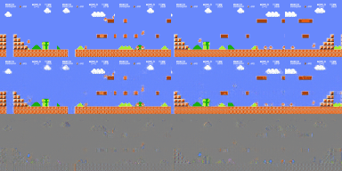

# DreamerV3 Algorithm: Usage Guide and Implementation Details

**Paper Reference**: [Mastering Diverse Domains through World Models](https://arxiv.org/abs/2301.04104) (Hafner et al., 2023)

This document provides both a practical usage guide for training and evaluating the Dreamer v3 model, as well as comprehensive implementation details in this codebase.

---

## Table of Contents

1. [Quick Start: Usage Guide](#quick-start-usage-guide)
   - [Training the Agent](#1-training-the-agent)
   - [Monitoring Training with TensorBoard](#2-monitoring-training-with-tensorboard)
   - [Playing Mario with the Trained Model](#3-playing-mario-with-the-trained-model)
2. [Key Concepts and Notation](#1-key-concepts-and-notation)
3. [Major Components](#2-major-components)
4. [Loss Functions](#3-loss-functions)
5. [Training Process](#4-training-process)
6. [Implementation Tricks](#5-implementation-tricks)

---

## Quick Start: Usage Guide

### 1. Training the Agent

**Basic Training (Standard Configuration):**
```bash
# Train with default hyperparameters
python train_mario_dreamer.py --configs defaults
```

**GPU-Optimized Training (Recommended for Higher end GPUs):**

If you have a GPU with 24GB+ VRAM and want to maximize training speed:
```bash
# Enable mixed precision (FP16) and larger batch sizes for better GPU utilization
python train_mario_dreamer.py --configs defaults gpu_optimized
```

**What `gpu_optimized` does:**
- **Mixed Precision (FP16)**: Reduces memory usage by ~50% and speeds up training by ~2x on tensor core GPUs
- **Larger Batch Sizes**: Increases batch_size from 16→32 and batch_length from 64→80 to better utilize GPU parallelism
- **More Training Steps**: Increases train_ratio from 512→768 for more gradient updates per environment step
- **Expected Performance**: 60-80% GPU utilization (vs. 20-30% without optimization)

**Other Training Options:**

```bash
# Debug mode (fast iteration for testing code changes)
python train_mario_dreamer.py --configs defaults debug

# Resume from checkpoint
python train_mario_dreamer.py --logdir ./logdir/mario

# Custom log directory
python train_mario_dreamer.py --configs defaults --logdir ./my_experiments/mario_run1
```

**Training Progress:**
- The agent will train for 400,000 steps (or 10,000 in debug mode)
- Evaluation runs every 10,000 steps
- Checkpoints are saved periodically in `logdir/mario/`

---

### 2. Monitoring Training with TensorBoard

DreamerV3 logs extensive metrics and visualizations to TensorBoard. Launch it to monitor training in real-time:

```bash
# Start TensorBoard (point it to your log directory)
tensorboard --logdir ./logdir/mario

# Then open http://localhost:6006 in your browser
```

**Key Metrics to Monitor:**

**Scalars Tab:**
- `eval_return`: Episode return during evaluation (target: ~4000+ for completion)
- `model_loss`: World model training loss (should decrease over time)
- `actor_loss`: Policy loss (stabilizes after initial training)
- `value_loss`: Critic loss (should decrease)
- `kl_divergence`: KL between posterior and prior (typically 1-5)

**Images Tab (Video Predictions):**

One of the most insightful visualizations is the **open-loop video prediction** (`train_openl`), which shows how well the world model can predict future frames without seeing them:

<p align="center">
  
</p>

**Understanding the Animation:**
- **Rows**: Different episodes/sequences from the batch (typically 4 rows shown)
- **Columns**: Time progression (each column is a timestep)
  - **First column**: Ground truth observation from replay buffer
  - **Remaining columns**: Model's predictions rolling forward in imagination
- **What to look for**:
  - ✅ **Good predictions**: Imagined frames match Mario's actual movement and environment
  - ❌ **Poor predictions**: Blurry frames, Mario disappearing, or physics violations
  - As training progresses, predictions should become sharper and more accurate

This visualization directly shows whether the world model has learned the game dynamics well enough for effective planning.

---

### 3. Playing Mario with the Trained Model

Once training is complete (or even during training), you can watch your agent play:

**Basic Usage:**
```bash
# Play 5 episodes using the trained model (stochastic sampling by default)
python play_mario_dreamer.py --logdir logdir/mario --episodes 5
```

**Deterministic Mode:**
```bash
# Use deterministic actions (always pick the mode/most likely action)
python play_mario_dreamer.py --logdir logdir/mario --episodes 5 --action-mode
```

**Save Episodes as GIFs:**
```bash
# Record episodes and save as animated GIFs
python play_mario_dreamer.py --logdir logdir/mario --episodes 5 --save-gif

# Customize GIF settings
python play_mario_dreamer.py --logdir logdir/mario --episodes 5 --save-gif --gif-fps 30 --gif-dir ./my_gifs
```

**Options:**
- `--logdir`: Directory containing the trained model checkpoint
- `--episodes`: Number of episodes to play (default: 5)
- `--action-mode`: Use deterministic actions instead of stochastic sampling
- `--save-gif`: Save each episode as an animated GIF
- `--gif-fps`: Frames per second for saved GIFs (default: 20)
- `--gif-dir`: Directory to save GIF files (default: same as logdir)
- `--use-best`: Load best checkpoint instead of latest (default: True)

**What to Expect:**
- The agent should be able to complete Stage 1-1 after ~100,000-200,000 training steps
- Final reward should be around 4000-4100 (includes flag bonus of 1000)
- Episode length typically 250-350 steps with action_repeat=4

---

## 1. Key Concepts and Notation

DreamerV3 operates in a latent space where it learns compact representations of the environment. Here are the key mathematical symbols used throughout the paper and this implementation:

### 1.1 Observations and Actions

| Symbol | Dimension | Description | Mario Example |
|--------|-----------|-------------|---------------|
| $o_t$ | (64, 64, 3) | Raw observation (image) at time t | Screenshot of Mario game (64×64 RGB image) showing Mario, enemies, blocks, etc. |
| $a_t$ | (7,) | Action taken at time t (one-hot) | One of 7 discrete actions: NOOP, right, right+A, right+B, right+A+B, A (jump), left |
| $r_t$ | (1,) | Reward received at time t | Distance traveled + 1000 for reaching flag - penalties for dying |
| $c_t$ | (1,) | Continuation flag (1 - terminal) | 0 when Mario dies or reaches flag, 1 otherwise |

### 1.2 Latent States (RSSM)

The core of DreamerV3 is the Recurrent State Space Model (RSSM), which maintains a latent representation of the environment state:

| Symbol | Dimension | Description | Mario Example |
|--------|-----------|-------------|---------------|
| $h_t$ | (512,) | **Deterministic state** (recurrent hidden state from GRU) | Captures temporal dependencies: e.g., Mario's velocity, recent trajectory, which direction he's moving |
| $z_t$ | (32, 32) | **Stochastic state** (32 categorical distributions, each with 32 classes) | Captures stochastic aspects: e.g., exact positions of enemies, coin locations, randomness in enemy movements |
| $e_t$ | (4096,) | **Embedding** (encoded observation) | Compressed representation of the 64×64×3 image capturing visual features like edges, textures, object locations |

### 1.3 Combined Features

| Symbol | Dimension | Description | Usage |
|--------|-----------|-------------|-------|
| $s_t = [z_t; h_t]$ | (1536,) | **Feature vector** (concatenation of flattened stochastic and deterministic states) | Input to all prediction heads (decoder, reward, continuation) and actor-critic networks |

**Dimensionality breakdown:**
- Stochastic: 32 categoricals × 32 classes = 1024 dimensions (one-hot encoded)
- Deterministic: 512 dimensions (GRU hidden state)
- **Total features: 1024 + 512 = 1536 dimensions**

### 1.4 Distributions

| Symbol | Type | Description | Purpose |
|--------|------|-------------|---------|
| $q(z_t \mid h_t, o_t)$ | Posterior | Belief about latent state given observation | Used during training to infer true state from observations (closed-loop) |
| $p(z_t \mid h_t)$ | Prior | Predicted latent state without observation | Used during imagination/planning (open-loop) |
| $p(r_t \mid s_t)$ | Reward predictor | Predicted reward distribution | Enables planning by predicting future rewards |
| $p(c_t \mid s_t)$ | Continue predictor | Predicted continuation probability | Predicts whether episode continues (for discount factors) |
| $\pi(a_t \mid s_t)$ | Policy | Action distribution | Agent's policy for selecting actions |

### 1.5 Temporal Notation

Throughout this document:
- **t** denotes the current timestep
- **t-1** denotes the previous timestep
- **t+1** denotes the next timestep

**Example sequence in Mario:**
1. At t=0: Mario is standing, observes initial screen → h_0, z_0
2. Action a_0: Press "right" → Mario starts moving
3. At t=1: New observation shows Mario moved → h_1, z_1 (updated state)
4. Reward r_1: +1 for distance traveled
5. Continue c_1: 1 (episode continues)

---

## 2. Major Components

DreamerV3 consists of several neural network components that work together to learn a world model and policy.

### 2.1 Encoder

**Mathematical Definition:**

$$e_t = f_{enc}(o_t)$$

**Purpose:** Maps high-dimensional observations to compact embeddings.

**Architecture:** Convolutional Neural Network (CNN)
```
Input: o_t ∈ ℝ^(64×64×3)
  ↓ Conv2d(32 channels, stride=2) + LayerNorm + SiLU  → (32×32×32)
  ↓ Conv2d(64 channels, stride=2) + LayerNorm + SiLU  → (16×16×64)
  ↓ Conv2d(128 channels, stride=2) + LayerNorm + SiLU → (8×8×128)
  ↓ Conv2d(256 channels, stride=2) + LayerNorm + SiLU → (4×4×256)
  ↓ Flatten → e_t ∈ ℝ^4096
```

**Implementation:**
- Class: [`MultiEncoder`](../dreamerv3/networks/encoder_decoder.py#L31) wraps [`ConvEncoder`](../dreamerv3/networks/encoder_decoder.py#L309)
- Initialization: [world_model.py:77](../dreamerv3/world_model.py#L77)

**Mario Example:** The encoder compresses a 64×64×3 RGB image of the game into a 4096-dimensional vector that captures visual features like Mario's position, nearby enemies, blocks, and pipes.

---

### 2.2 Recurrent State Space Model (RSSM)

The RSSM is the **core dynamics model** that learns to predict future states. It consists of deterministic and stochastic components.

**Mathematical Definition:**

**Deterministic transition (GRU):**

$$h_t = f_\theta(h_{t-1}, z_{t-1}, a_{t-1})$$

where $f_\theta$ is a GRU (Gated Recurrent Unit) cell.

**Stochastic transition:**
```
Prior:     p(z_t | h_t)              [used for imagination/planning]
Posterior: q(z_t | h_t, e_t)         [used for learning from observations]
```

Both prior and posterior are **categorical distributions**:
```
z_t ∈ {0,1}^(32×32)   (32 independent categorical distributions, each with 32 classes)
```

**Full update equations:**
```
1. Compute deterministic state:
   h_t = GRU(h_{t-1}, [z_{t-1}, a_{t-1}])

2. Compute prior (imagination):
   logits_prior = MLP_prior(h_t)
   p(z_t | h_t) = Categorical(logits_prior)

3. Compute posterior (observation):
   logits_post = MLP_post([h_t, e_t])
   q(z_t | h_t, e_t) = Categorical(logits_post)

4. Sample stochastic state:
   z_t ~ q(z_t | h_t, e_t)  [during training]
   z_t ~ p(z_t | h_t)        [during imagination]
```

**Implementation:**
- Class: [`RSSM`](../dreamerv3/networks/rssm.py#L28)
- Sequential observation processing: [`observe()`](../dreamerv3/networks/rssm.py#L219)
- Single observation step: [`obs_step()`](../dreamerv3/networks/rssm.py#L269)
- Imagination step: [`img_step()`](../dreamerv3/networks/rssm.py#L343)
- Initialization: [world_model.py:83](../dreamerv3/world_model.py#L83)

**Mario Example:**
- $h_t$ (deterministic): Tracks Mario's momentum, direction, recent movement patterns
- $z_t$ (stochastic): Captures uncertain elements like enemy positions that can't be fully predicted from previous states alone
- **Prior** predicts next frame without seeing it (useful for planning)
- **Posterior** incorporates actual observation to correct predictions

---

### 2.3 Decoder

**Mathematical Definition:**

$$\hat{o}_t = f_{dec}(s_t) = f_{dec}([z_t; h_t])$$

**Purpose:** Reconstructs observations from latent features to ensure the latent representation captures all relevant information.

**Architecture:** Transposed Convolutional Neural Network (CNN)
```
Input: s_t ∈ ℝ^1536
  ↓ Linear                                             → ℝ^4096
  ↓ Reshape                                            → (4×4×256)
  ↓ ConvTranspose2d(128, stride=2) + LayerNorm + SiLU → (8×8×128)
  ↓ ConvTranspose2d(64, stride=2) + LayerNorm + SiLU  → (16×16×64)
  ↓ ConvTranspose2d(32, stride=2) + LayerNorm + SiLU  → (32×32×32)
  ↓ ConvTranspose2d(3, stride=2)  → ô_t ∈ ℝ^(64×64×3)
```

**Implementation:**
- Class: [`MultiDecoder`](../dreamerv3/networks/encoder_decoder.py#L155) wraps [`ConvDecoder`](../dreamerv3/networks/encoder_decoder.py#L415)
- Initialization: [world_model.py:112](../dreamerv3/world_model.py#L112)

**Mario Example:** Reconstructs the 64×64×3 game screenshot from the latent state. If the reconstruction is accurate, it means $s_t$ contains sufficient information about the game state.

---

### 2.4 Reward Predictor

**Mathematical Definition:**

$$\hat{r}_t \sim p(r_t \mid s_t) = \text{DiscretizedDistribution}(\text{MLP}(s_t))$$

**Purpose:** Predicts the reward that will be received in each state, enabling the agent to plan without environment interaction.

**Architecture:** Multi-Layer Perceptron (MLP) with discretized output
```
Input: s_t ∈ ℝ^1536
  ↓ Linear(512) + LayerNorm + SiLU
  ↓ Linear(512) + LayerNorm + SiLU
  ↓ Linear(512) + LayerNorm + SiLU
  ↓ Linear(255)                      → logits ∈ ℝ^255
  ↓ DiscretizedDistribution          → p(r_t | s_t)
```

**Why Discretize Rewards (Classification vs Regression)?**

Instead of directly predicting a single reward value $\hat{r}_t \in \mathbb{R}$ (regression), DreamerV3 predicts a **categorical distribution over 255 discrete buckets** (classification):

1. **Better Gradients**: Classification provides stronger, more stable gradients than MSE regression
2. **Uncertainty Representation**: Can represent multimodal distributions and uncertainty
3. **Outlier Robustness**: Bounded output space prevents extreme predictions
4. **Empirical Performance**: Consistently outperforms regression in practice

**How It Works:**

1. MLP outputs 255 logits (one per bucket)
2. Apply softmax to get probability distribution: $p_i = \text{softmax}(\text{logits})_i$
3. Expected reward: $\mathbb{E}[r] = \text{symexp}(\sum_{i=1}^{255} p_i \cdot \text{bucket}_i)$
4. During training, use two-bucket interpolation (see Section 5.2) for continuous target values

**Output Distribution:** Discretized distribution in symlog space
- 255 buckets spanning [-20, 20] in symlog space
- Predicts categorical distribution over buckets
- Converts back to continuous reward via expected value

**Implementation:**
- Initialization: [world_model.py:118](../dreamerv3/world_model.py#L118)
- Forward pass: Uses [`MLP`](../dreamerv3/networks/encoder_decoder.py#L587) with `dist="symlog_disc"`
- Distribution: [`DiscDist`](../dreamerv3/utils/distributions.py#L178)

---

### 2.5 Continuation Predictor

**Mathematical Definition:**

$$\hat{c}_t \sim p(c_t \mid s_t) = \text{Bernoulli}(\text{sigmoid}(\text{MLP}(s_t)))$$

where $c_t = 1 - \text{terminal}_t$ (i.e., 1 if episode continues, 0 if it ends).

**Purpose:** Predicts whether the episode will continue, used to compute proper discount factors during planning.

**Architecture:** MLP with Bernoulli output
```
Input: s_t ∈ ℝ^1536
  ↓ Linear(512) + LayerNorm + SiLU
  ↓ Linear(512) + LayerNorm + SiLU
  ↓ Linear(512) + LayerNorm + SiLU
  ↓ Linear(1)                        → logit ∈ ℝ
  ↓ Sigmoid                          → p(c_t | s_t) ∈ [0,1]
```

**Implementation:**
- Initialization: [world_model.py:133](../dreamerv3/world_model.py#L133)
- Forward pass: Uses [`MLP`](../dreamerv3/networks/encoder_decoder.py#L587) with `dist="binary"`
- Distribution: [`Bernoulli`](../dreamerv3/utils/distributions.py#L481)

**Mario Example:**
- $c_t \approx 1.0$ when Mario is alive and running
- $c_t \approx 0.0$ when Mario is about to die (falls in pit, touches enemy)
- $c_t \approx 0.0$ when Mario is about to reach the flag

---

### 2.6 Actor (Policy Network)

**Mathematical Definition:**

$$a_t \sim \pi(a_t \mid s_t) = \text{OneHotCategorical}(\text{softmax}(\text{MLP}(s_t)))$$

**Purpose:** The policy network that selects actions to maximize expected return.

**Architecture:** MLP with categorical output (discrete actions)
```
Input: s_t ∈ ℝ^1536
  ↓ Linear(512) + LayerNorm + SiLU
  ↓ Linear(512) + LayerNorm + SiLU
  ↓ Linear(512) + LayerNorm + SiLU
  ↓ Linear(7)                        → logits ∈ ℝ^7
  ↓ Softmax + StraightThrough        → π(a_t | s_t)
```

**Output Distribution:** One-hot categorical with 7 actions
- Uses straight-through gradients for discrete sampling
- Adds uniform mixing (unimix_ratio=0.01) for exploration

**Implementation:**
- Class: [`MLP`](../dreamerv3/networks/encoder_decoder.py#L587) with `dist="onehot"`
- Initialization: [actor_critic.py:69](../dreamerv3/actor_critic.py#L69)
- Distribution: [`OneHotDist`](../dreamerv3/utils/distributions.py#L52)

**Mario Example:** For a given state $s_t$, outputs probabilities over actions:
```
π(a_t | s_t) = [0.05, 0.70, 0.10, 0.05, 0.05, 0.03, 0.02]
               [NOOP, right, right+A, right+B, right+A+B, A, left]
```
Most likely action: "right" (keep moving forward).

---

### 2.7 Critic (Value Network)

**Mathematical Definition:**

$$\hat{V}(s_t) \sim p(V(s_t) \mid s_t) = \text{DiscretizedDistribution}(\text{MLP}(s_t))$$

**Purpose:** Estimates the expected cumulative return from state $s_t$ following policy $\pi$.

**Architecture:** MLP with discretized output
```
Input: s_t ∈ ℝ^1536
  ↓ Linear(512) + LayerNorm + SiLU
  ↓ Linear(512) + LayerNorm + SiLU
  ↓ Linear(512) + LayerNorm + SiLU
  ↓ Linear(255)                      → logits ∈ ℝ^255
  ↓ DiscretizedDistribution          → p(V(s_t) | s_t)
```

**Output Distribution:** Discretized distribution in symlog space (same as reward predictor)
- 255 buckets spanning [-20, 20] in symlog space
- Predicts categorical distribution over value buckets

**Implementation:**
- Initialization: [actor_critic.py:86](../dreamerv3/actor_critic.py#L86)
- Forward pass: Uses [`MLP`](../dreamerv3/networks/encoder_decoder.py#L587) with `dist="symlog_disc"`
- Distribution: [`DiscDist`](../dreamerv3/utils/distributions.py#L178)
- Slow target network: [actor_critic.py:101](../dreamerv3/actor_critic.py#L101)

**Mario Example:** For Mario standing near the flag:
- $V(s_t) \approx 1000$ (high value, about to win)

For Mario about to fall in a pit:
- $V(s_t) \approx -100$ (low value, about to die)

---

**During imagination:**
- Start from a latent state $s_0$
- Actor samples action: $a_0 \sim \pi(\cdot \mid s_0)$
- RSSM predicts next state: $s_1$
- **Reward Predictor** predicts: $\hat{r}_1$ (immediate reward)
- **Critic** predicts: $\hat{V}(s_1)$ (future cumulative return)
- Repeat for horizon steps (e.g., 15 steps)
- Compute λ-returns: $\hat{V}_\lambda(s_0) = \hat{r}_1 + \gamma [\hat{r}_2 + \gamma [\hat{r}_3 + ... + \gamma \hat{V}(s_{15})]]$
- Update actor to maximize $\hat{V}_\lambda(s_0)$
- Update critic to predict $\hat{V}_\lambda(s_0)$ accurately

---

## 3. Loss Functions

DreamerV3 training involves multiple loss functions that train different components of the model.

### 3.1 World Model Losses

The world model is trained with four loss components:

**Total World Model Loss:**

$$\mathcal{L}_{world} = \mathcal{L}_{reconstruction} + \mathcal{L}_{reward} + \mathcal{L}_{continue} + \mathcal{L}_{KL}$$

**Implementation:** [world_model.py:174-303](../dreamerv3/world_model.py#L174)

---

#### 3.1.1 Reconstruction Loss

**Mathematical Definition:**

$$\mathcal{L}_{reconstruction} = -\mathbb{E}_{q(z_t|h_t,o_t)} [\log p(o_t | z_t, h_t)] = -\log p(o_t | f_{dec}([z_t; h_t]))$$

**Purpose:** Ensures the decoder can reconstruct observations from latent states, forcing the latent representation to retain all relevant information.

**Implementation:**
```python
# Compute reconstruction distribution
decoder_dist = self.heads["decoder"](features)

# Negative log-likelihood
loss_reconstruction = -decoder_dist["image"].log_prob(observations["image"])
```

**Distribution Type:** MSE distribution ([`MSEDist`](../dreamerv3/utils/distributions.py#L291))

**Code Location:** [world_model.py:252](../dreamerv3/world_model.py#L252) in `_train()` method

**Mario Example:** Measures how well the decoder reconstructs the 64×64×3 game screen:
- Low loss: Reconstructed image clearly shows Mario, enemies, blocks
- High loss: Blurry reconstruction, missing details

---

#### 3.1.2 Reward Loss

**Mathematical Definition:**

$$\mathcal{L}_{reward} = -\mathbb{E}_{q(z_t|h_t,o_t)} [\log p(r_t | z_t, h_t)] = -\log p(r_t | \text{MLP}_{reward}([z_t; h_t]))$$

**Purpose:** Trains the reward predictor to accurately predict rewards, essential for planning.

**Implementation:**
```python
# Predict reward distribution (255-way discretized in symlog space)
reward_dist = self.heads["reward"](features)

# Negative log-likelihood
loss_reward = -reward_dist.log_prob(rewards)
```

**Distribution Type:** Discretized distribution in symlog space ([`DiscDist`](../dreamerv3/utils/distributions.py#L178))
- 255 buckets from -20 to 20 in symlog space
- Uses two-bucket interpolation for continuous values

**Loss Scale:** Configurable, default = 1.0

**Code Location:** [world_model.py:252](../dreamerv3/world_model.py#L252) in `_train()` method

**Mario Example:**
- True reward: $r_t = 5.0$ (moved right 5 pixels)
- Predicted distribution: peaks around $\text{symlog}(5.0) \approx 1.95$
- Loss: negative log probability of true reward under predicted distribution

---

#### 3.1.3 Continuation Loss

**Mathematical Definition:**

$$\mathcal{L}_{continue} = -\mathbb{E}_{q(z_t|h_t,o_t)} [\log p(c_t | z_t, h_t)] = -\log \text{Bernoulli}(c_t | \sigma(\text{MLP}_{cont}([z_t; h_t])))$$

where $c_t = 1 - \text{terminal}_t$.

**Purpose:** Trains the continuation predictor to forecast episode termination, used for computing discount factors.

**Implementation:**
```python
# Predict continuation probability
cont_dist = self.heads["cont"](features)

# Negative log-likelihood (binary cross-entropy)
loss_continue = -cont_dist.log_prob(continuations)
```

**Distribution Type:** Bernoulli distribution ([`Bernoulli`](../dreamerv3/utils/distributions.py#L481))

**Loss Scale:** Configurable, default = 1.0

**Code Location:** [world_model.py:252](../dreamerv3/world_model.py#L252) in `_train()` method

**Mario Example:**
- True continuation: $c_t = 0$ (Mario died)
- Predicted probability: $p(c_t=1) = 0.05$ (model correctly predicts end)
- Loss: $-\log(0.95) \approx 0.05$ (low loss, good prediction)

---

#### 3.1.4 KL Divergence Loss

**Mathematical Definition:**

The KL loss consists of two components that balance representation learning:

$$\mathcal{L}_{KL} = \alpha_{dyn} \cdot \mathcal{L}_{dynamics} + \alpha_{rep} \cdot \mathcal{L}_{representation}$$

where:
$$\mathcal{L}_{dynamics} = \mathbb{E}[\text{KL}(\text{sg}(q(z_t|h_t,o_t)) \| p(z_t|h_t))]$$
$$\mathcal{L}_{representation} = \mathbb{E}[\text{KL}(q(z_t|h_t,o_t) \| \text{sg}(p(z_t|h_t)))]$$

and $\text{sg}(\cdot)$ denotes stop_gradient.

**Default scales:**
- $\alpha_{dyn} = 0.5$
- $\alpha_{rep} = 0.1$

**Purpose:**
1. **Dynamics loss:** Encourages the prior $p(z_t|h_t)$ to match the posterior, making imagination accurate
2. **Representation loss:** Encourages the posterior to be predictable from the prior, preventing the encoder from using information that can't be predicted

**Free Bits:** Both KL terms are clipped below a threshold (free_nats = 0.6) to prevent the posterior from collapsing to the prior.

```
L_dynamics_clipped = max(L_dynamics, free_nats)
L_representation_clipped = max(L_representation, free_nats)
```

**Implementation:**
```python
# Compute KL divergence with free bits
kl_loss, kl_value, dyn_loss, rep_loss = self.dynamics.kl_loss(
    posterior, prior,
    free_nats=0.6,
    dyn_scale=0.5,
    rep_scale=0.1
)
```

**Code Location:**
- Main call: [world_model.py:225](../dreamerv3/world_model.py#L225)
- Implementation: [rssm.py:520](../dreamerv3/networks/rssm.py#L520) in `kl_loss()` method

**Mario Example:**
- **Dynamics loss:** Measures how well the model can predict next frame without seeing it
  - High loss: Unpredictable elements (e.g., random enemy movement)
  - Low loss: Predictable elements (e.g., Mario's position from velocity)
- **Representation loss:** Prevents overfitting to noise in observations
  - Ensures encoder doesn't capture irrelevant details

---

### 3.2 Actor-Critic Losses

The actor and critic are trained using imagined trajectories from the world model.

---

#### 3.2.1 λ-Returns (TD(λ) Targets)

**Mathematical Definition:**

The λ-return interpolates between one-step TD and Monte Carlo returns:

$$\hat{V}_\lambda(s_t) = r_t + \gamma_t [(1-\lambda) V(s_{t+1}) + \lambda \hat{V}_\lambda(s_{t+1})]$$

Recursively expanded:

$$\hat{V}_\lambda(s_t) = r_t + \gamma_t (1-\lambda) V(s_{t+1}) + \gamma_t \lambda r_{t+1} + \gamma_t \gamma_{t+1} \lambda (1-\lambda) V(s_{t+2}) + \gamma_t \gamma_{t+1} \lambda^2 r_{t+2} + \ldots + \gamma_t \cdots \gamma_{T-1} \lambda^{T-t-1} V(s_T)$$

where:
- $\lambda = 0.95$: mixing parameter (default)
- $\gamma_t = c_t \cdot \gamma_{base}$: discount ($c_t$ is continuation, $\gamma_{base} \approx 0.997$)
- $V(s_T)$: bootstrap value at horizon

**Special cases:**
- $\lambda = 0$: One-step TD (high bias, low variance)
- $\lambda = 1$: Monte Carlo (low bias, high variance)
- $\lambda = 0.95$: Balanced trade-off (DreamerV3 default)

**Purpose:** λ-returns are used as **targets** for both actor and critic training. They provide a better estimate of the true return than either one-step TD or full Monte Carlo rollouts by balancing bias and variance.

**Implementation:**
```python
def lambda_return(reward, value, pcont, bootstrap, lambda_, axis):
    """
    Compute λ-returns backwards from the end of the trajectory.

    Args:
        reward: (time, batch, 1) - predicted rewards
        value: (time, batch, 1) - value estimates
        pcont: (time, batch, 1) - continuation * discount
        bootstrap: (batch, 1) - final value for bootstrapping
        lambda_: float - λ parameter
    """
    # Compute TD targets: r_t + γ_t V(s_{t+1})
    next_values = torch.cat([value[1:], bootstrap[None]], dim=0)
    inputs = reward + pcont * next_values * (1 - lambda_)

    # Recursively compute λ-returns backwards
    returns = static_scan_backwards(
        lambda agg, cur: cur + lambda_ * agg,
        inputs, pcont, bootstrap
    )
    return returns
```

**Code Location:**
- Function: [tools.py:308](../dreamerv3/utils/tools.py#L308) `lambda_return()`
- Usage in actor-critic: [actor_critic.py:202](../dreamerv3/actor_critic.py#L202) in `_compute_target()`

**Mario Example:**
Imagine a trajectory where Mario is about to reach the flag:

```
t=0: r=1,  V(s_1)=100   → V̂_λ(s_0) = 1 + 0.997·[0.05·100 + 0.95·V̂_λ(s_1)]
t=1: r=1,  V(s_2)=200   → V̂_λ(s_1) = 1 + 0.997·[0.05·200 + 0.95·V̂_λ(s_2)]
t=2: r=1000, V(s_3)=0   → V̂_λ(s_2) = 1000 + 0.997·[0.05·0 + 0.95·0] ≈ 1000
```

The λ-returns incorporate the large reward at t=2 backwards through the trajectory.

---

#### 3.2.2 Actor Loss (Policy Gradient)

**Mathematical Definition:**

$$\mathcal{L}_{actor} = -\mathbb{E}_\tau [w_t \cdot \text{objective}_t] - \beta_{ent} \cdot H[\pi(\cdot|s_t)]$$

where:
- $\tau$: imagined trajectory
- $w_t$: cumulative discount weights (see explanation below)
- $\text{objective}_t$: depends on gradient estimator (see below)
- $H[\pi]$: policy entropy
- $\beta_{ent} = 0.001$: entropy coefficient (config default)

**What are the weights $w_t$?**

The weights $w_t$ are **cumulative discount factors** that downweight gradient contributions from distant future timesteps:

$$w_t = \prod_{i=0}^{t-1} \gamma_i = \gamma_0 \cdot \gamma_1 \cdot \gamma_2 \cdots \gamma_{t-1}$$

where $\gamma_i = c_i \cdot \gamma_{base}$ (continuation probability × base discount).

**Intuition:**
- $w_0 = 1$ (current state: full weight)
- $w_1 = \gamma_0$ (1 step ahead: discounted once)
- $w_2 = \gamma_0 \cdot \gamma_1$ (2 steps ahead: discounted twice)
- $w_{15} = \gamma_0 \cdot \gamma_1 \cdots \gamma_{14}$ (15 steps ahead: heavily discounted)

This naturally weights the policy gradient by trajectory probability - states further into the imagined future have exponentially less influence on the gradient.

**Note:** These are NOT importance sampling weights (which would be $\frac{\pi_{new}}{\pi_{old}}$ for off-policy correction). DreamerV3 trains on-policy in imagination, so no importance sampling is needed.

**Gradient Estimators:**

DreamerV3 supports three gradient estimators for the actor loss. The **default is REINFORCE** (config: `imag_gradient='reinforce'`):

**1. REINFORCE (Default for discrete actions):**

In the general formulation above, REINFORCE sets:

$$\text{objective}_t = \text{sg}\left(\frac{\hat{V}_\lambda(s_t) - V_\phi(s_t)}{\max(1, S)}\right) \log \pi_\theta(a_t \mid s_t)$$

So the **complete loss** becomes:

$$\mathcal{L}_{actor} = -\sum_{t=0}^{T-1} w_t \cdot \text{sg}\left(\frac{\hat{V}_\lambda(s_t) - V_\phi(s_t)}{\max(1, S)}\right) \log \pi_\theta(a_t \mid s_t) + \beta H[\pi_\theta(a_t \mid s_t)]$$

where:
- $w_t$: cumulative discount weights (explained above)
- $\text{sg}(\cdot)$: stop_gradient (don't backprop through advantage)
- $\hat{V}_\lambda(s_t) - V_\phi(s_t)$: advantage (how much better than expected)
- $S$: adaptive normalization scale (see below)
- $\beta = 0.001$: entropy coefficient

**Adaptive Normalization (Outlier Robustness):**

To handle multi-modal return distributions and outliers, advantages are normalized by the range between 5th and 95th percentiles:

$$S = \text{EMA}(\text{Percentile}(\hat{V}_\lambda, 95) - \text{Percentile}(\hat{V}_\lambda, 5), 0.99)$$

- Computes 5th and 95th percentiles of returns across the batch
- Takes the range (95th - 5th) to get the scale
- Smooths using exponential moving average (α=0.99)
- Normalizes advantage: $\frac{\text{advantage}}{\max(1, S)}$ (prevents division by tiny values)

**Why this normalization?**
- **Robustness**: Outliers don't dominate the gradient
- **Multi-modal returns**: Different episodes may have different achievable returns
- **Stability**: EMA smooths out noisy scale estimates

**How it works**: Multiply log probability of taken action by normalized advantage
- **Gradient**: $\nabla_\theta \mathcal{L}_{actor} = -\mathbb{E}[\text{sg}(\text{advantage}/S) \cdot \log \pi_\theta(a_t \mid s_t)]$
- **Pros**: Standard policy gradient, well-understood, works for any action space, robust to outliers
- **Cons**: High variance (mitigated by baseline and normalization)
- **Used for**: Discrete actions (like Mario's 7 button combinations)

**2. Dynamics Backpropagation:**

In the general formulation, dynamics backpropagation sets:

$$\text{objective}_t = \hat{V}_\lambda(s_t) - V_\phi(s_t)$$

So the **complete loss** becomes:

$$\mathcal{L}_{actor} = -\sum_{t=0}^{T-1} w_t \cdot (\hat{V}_\lambda(s_t) - V_\phi(s_t)) + \beta H[\pi_\theta(a_t \mid s_t)]$$

- **How it works**: Backpropagate directly through the differentiable world model
- **Gradient**: $\nabla_\theta \mathcal{L}_{actor} = -\mathbb{E}[w_t \cdot \nabla_\theta \hat{V}_\lambda(s_t)]$
- **Pros**: Lower variance, leverages differentiable world model
- **Cons**: Biased if world model is inaccurate, only works with differentiable models
- **Used for**: Continuous actions or when model quality is high

**3. Both (Interpolation):**

In the general formulation, interpolation sets:

$$\text{objective}_t = \alpha \cdot (\hat{V}_\lambda(s_t) - V_\phi(s_t)) + (1-\alpha) \cdot \text{sg}\left(\frac{\hat{V}_\lambda(s_t) - V_\phi(s_t)}{\max(1, S)}\right) \log \pi_\theta(a_t \mid s_t)$$

So the **complete loss** becomes:

$$\mathcal{L}_{actor} = -\sum_{t=0}^{T-1} w_t \cdot \text{objective}_t + \beta H[\pi_\theta(a_t \mid s_t)]$$

- Interpolates between dynamics ($\alpha$) and REINFORCE ($1-\alpha$)
- Config: `imag_gradient='both'` with `imag_gradient_mix` setting $\alpha$

---

**Implementation:**
```python
# Recompute policy distribution
policy = self.actor(imag_feat.detach())

# Choose gradient estimator
if config.imag_gradient == "reinforce":
    # REINFORCE: log π(a|s) * advantage
    actor_target = (
        policy.log_prob(imag_action)[:-1] *
        (target - self.value(imag_feat[:-1]).mode()).detach()
    )
elif config.imag_gradient == "dynamics":
    # Dynamics: backprop through world model
    actor_target = target - baseline
elif config.imag_gradient == "both":
    # Interpolation between the two
    mix = config.imag_gradient_mix
    actor_target = mix * (target - baseline) + (1 - mix) * reinforce_target

# Weighted negative objective
actor_loss = -weights[:-1] * actor_target

# Add entropy regularization
actor_loss = actor_loss - config.actor["entropy"] * actor_entropy

# Mean over batch and time
actor_loss = torch.mean(actor_loss)
```

**Code Location:**
- Main computation: [actor_critic.py:208](../dreamerv3/actor_critic.py#L208) in `_train()`
- Gradient estimator selection: [actor_critic.py:458-492](../dreamerv3/actor_critic.py#L458-L492) in `_compute_actor_loss()`
- Config: [dreamer_configs.yaml:153](../configs/dreamer_configs.yaml#L153) sets `imag_gradient='reinforce'`

**Mario Example:**

Using **REINFORCE** (default):
- **Good trajectory** (leads to flag, $\hat{V}_\lambda = 1100$, $V = 500$):
  - Advantage: $1100 - 500 = +600$ (positive)
  - For each action in trajectory: Increase $\log \pi_\theta(a_t \mid s_t)$
  - Effect: Make those actions more likely in similar states

- **Bad trajectory** (Mario dies, $\hat{V}_\lambda = -50$, $V = 500$):
  - Advantage: $-50 - 500 = -550$ (negative)
  - For each action in trajectory: Decrease $\log \pi_\theta(a_t \mid s_t)$
  - Effect: Make those actions less likely in similar states

- **Entropy term:** Encourages trying different button combinations rather than always moving right

---

#### 3.2.3 Critic Loss (Value Function)

**Mathematical Definition:**

$$\mathcal{L}_{critic} = -\mathbb{E}[w_t \cdot \log p(\hat{V}_\lambda(s_t) | s_t)] + \text{(if slow\_target)} \; -\mathbb{E}[\log p(\hat{V}_{slow}(s_t) | s_t)]$$

where:
- $\hat{V}_\lambda(s_t)$: λ-return target (stop gradient, see Section 3.2.1)
- $\hat{V}_{slow}(s_t)$: slow target network prediction
- $w_t$: cumulative discount weights (same as actor loss, see Section 3.2.2)

**Purpose:** Trains the critic to predict λ-returns accurately. The critic provides baselines for the actor and is used during imagination for bootstrapping.

**Slow Target Regularization:**

Enabled by default (`slow_target=True` in config). Adds a regularization term using a slowly-updated copy of the value network to stabilize training:

$$V_{slow} \leftarrow 0.99 \cdot V_{slow} + 0.01 \cdot V$$

Updated every 100 steps (config: `slow_target_update=100`, `slow_target_fraction=0.01`).

**Implementation:**
```python
# Predict values
value_dist = self.value(features[:-1])

# Negative log-likelihood of target
value_loss = -value_dist.log_prob(target.detach())

# Optional: regularization with slow target
if config.critic["slow_target"]:
    slow_value_dist = self._slow_value(features[:-1])
    value_loss = value_loss - value_dist.log_prob(slow_value_dist.mode().detach())

# Weight by trajectory probabilities
value_loss = torch.mean(weights[:-1] * value_loss)
```

**Code Location:**
- Main computation: [actor_critic.py:226](../dreamerv3/actor_critic.py#L226) in `_train()`
- Slow target update: [actor_critic.py:499](../dreamerv3/actor_critic.py#L499) in `_update_slow_target()`

**Mario Example:**
- **Target:** $\hat{V}_\lambda(s_t) = 950$ (λ-return computed from imagined trajectory)
- **Prediction:** $V(s_t) \approx 900$ (critic underestimates)
- **Loss:** Negative log probability pushes predicted distribution toward 950

---

## 4. Training Process

This section describes how DreamerV3 is trained, including both the algorithmic flow and the actual implementation structure.

### 4.1 High-Level Algorithm Overview

DreamerV3 training follows a model-based reinforcement learning loop:

1. **Collect Experience (Closed-Loop Rollout)**
   - Interact with the real environment using current policy
   - Store transitions $(o_t, a_t, r_t, c_t)$ in replay buffer
   - Uses posterior inference: $q(z_t \mid h_t, o_t)$ to track true state

2. **Train World Model**
   - Sample batches of sequences from replay buffer
   - Train encoder, RSSM dynamics, and prediction heads (decoder, reward, continuation)
   - Minimize: $\mathcal{L}_{world} = \mathcal{L}_{reconstruction} + \mathcal{L}_{reward} + \mathcal{L}_{continue} + \mathcal{L}_{KL}$

3. **Imagination (Open-Loop Rollout)**
   - Start from latent states inferred from real data
   - Roll out policy in latent space using prior: $p(z_t \mid h_t)$
   - Generate imagined trajectories without environment interaction
   - Predict rewards along imagined trajectories

4. **Train Actor-Critic**
   - Compute λ-returns from imagined rewards and values
   - Update actor to maximize returns (policy gradient)
   - Update critic to predict returns accurately (value learning)

5. **Repeat**
   - Periodically evaluate policy in real environment
   - Save checkpoints and log metrics

**Key Insight:** Most training happens in imagination (step 3-4), making DreamerV3 extremely sample-efficient. The agent can perform thousands of gradient updates per environment interaction.

---

### 4.2 Implementation: Training Loop Pseudo-Code

Below is the actual training structure based on the current codebase:

```python
# ============================================================================
# INITIALIZATION (train_mario_dreamer.py)
# ============================================================================

# 1. Setup environment and replay buffer
#    Code: train_mario_dreamer.py:main()
env = make_mario_env(config)                     # envs/mario.py
replay_buffer = ReplayBuffer(config)             # Stores (o,a,r,done) sequences

# 2. Create DreamerV3 agent
#    Code: train_mario_dreamer.py:61-113
agent = DreamerAgent(
    obs_space, act_space, config, logger, dataset
)
#    ↓ Creates:
#    - world_model = WorldModel(...)              # dreamerv3/world_model.py:28
#        ↳ encoder: MultiEncoder                  # dreamerv3/networks/encoder_decoder.py:31
#        ↳ dynamics (RSSM)                        # dreamerv3/networks/rssm.py:28
#        ↳ decoder: MultiDecoder                  # dreamerv3/networks/encoder_decoder.py:155
#        ↳ reward_head: MLP                       # world_model.py:118
#        ↳ cont_head: MLP                         # world_model.py:133
#    - actor_critic = ActorCritic(...)            # dreamerv3/actor_critic.py:30
#        ↳ actor: MLP                             # actor_critic.py:69
#        ↳ critic: MLP                            # actor_critic.py:86

# ============================================================================
# MAIN TRAINING LOOP
# ============================================================================

# Code: train_mario_dreamer.py:main() - main training loop
for step in range(config.steps):                # Total: 400,000 steps

    # ========================================================================
    # STEP 1: COLLECT EXPERIENCE (Closed-Loop with Real Environment)
    # ========================================================================
    # Code: train_mario_dreamer.py - environment interaction loop

    obs = env.reset()                             # Initial observation from Mario
    done = False
    latent_state = None

    while not done:
        # (a) Execute policy in latent space
        #     Code: train_mario_dreamer.py:170 - _policy()
        policy_output, latent_state = agent._policy(obs, latent_state, training=True)
        #     ↓ Breaks down as:
        #       1. Preprocess: obs → normalized [0,1]
        #          Code: world_model.py:305 - preprocess()
        #       2. Encode: obs → embedding e_t
        #          Code: world_model.py:77 - encoder(obs)
        #       3. Posterior inference: (h_t-1, z_t-1, a_t-1, e_t) → (h_t, z_t)
        #          Code: rssm.py:269 - obs_step()
        #       4. Sample action: a_t ~ π(·|z_t, h_t)
        #          Code: actor_critic.py:69 - actor(features)

        action = policy_output["action"]

        # (b) Step environment
        obs_next, reward, done, info = env.step(action)

        # (c) Store in replay buffer
        replay_buffer.add(obs, action, reward, done)

        obs = obs_next

    # ========================================================================
    # STEP 2: TRAIN WORLD MODEL (Multiple Gradient Steps)
    # ========================================================================
    # Code: train_mario_dreamer.py:141-144
    # Performs train_ratio gradient steps per environment step
    # Default: train_ratio = 1024 (1024 updates per 1 environment step!)

    for _ in range(config.train_ratio):          # 1024 gradient steps
        # (a) Sample batch from replay buffer
        #     Shape: (batch_size=16, batch_length=64, ...)
        batch = replay_buffer.sample_batch()

        # (b) Train world model
        #     Code: train_mario_dreamer.py:233 - _train()
        #     Code: world_model.py:174 - WorldModel._train()
        metrics = agent._world_model._train(batch)
        #     ↓ Breaks down as:

        #     1. Preprocess observations
        #        Code: world_model.py:210
        data = world_model.preprocess(batch)

        #     2. Encode observations: o_t → e_t
        #        Code: world_model.py:214
        embed = encoder(data["image"])           # (B, T, 4096)

        #     3. Compute posterior and prior via RSSM
        #        Code: world_model.py:215-217
        posterior, prior = dynamics.observe(
            embed, data["action"], data["is_first"]
        )
        #        ↳ Sequential processing via static_scan:
        #          For t in 1..T:
        #            h_t = GRU(h_{t-1}, [z_{t-1}, a_{t-1}])
        #            logits_prior = MLP_prior(h_t)
        #            logits_post = MLP_post([h_t, e_t])
        #            z_t ~ Categorical(logits_post)
        #        Code: rssm.py:219 - observe(), calls obs_step() repeatedly

        #     4. Compute KL divergence loss
        #        Code: world_model.py:225
        kl_loss, kl_value, dyn_loss, rep_loss = dynamics.kl_loss(
            posterior, prior, free_nats=0.6, dyn_scale=0.5, rep_scale=0.1
        )
        #        Code: rssm.py:520 - kl_loss()
        #        Formula:
        #          L_dyn = max(KL(sg(posterior) || prior), 0.6)
        #          L_rep = max(KL(posterior || sg(prior)), 0.6)
        #          L_KL = 0.5 * L_dyn + 0.1 * L_rep

        #     5. Get features for predictions: [z_t; h_t]
        #        Code: world_model.py:229
        features = dynamics.get_latent_state_feature(posterior)  # (B, T, 1536)

        #     6. Compute prediction losses
        #        Code: world_model.py:231-254
        losses = {}

        #        (i) Decoder loss (reconstruction)
        decoder_dist = heads["decoder"](features)
        losses["decoder"] = -decoder_dist["image"].log_prob(data["image"])

        #        (ii) Reward loss
        reward_dist = heads["reward"](features)
        losses["reward"] = -reward_dist.log_prob(data["reward"])

        #        (iii) Continuation loss
        cont_dist = heads["cont"](features)
        losses["cont"] = -cont_dist.log_prob(data["cont"])

        #     7. Combine losses
        #        Code: world_model.py:263
        model_loss = sum(losses.values()) + kl_loss

        #     8. Backpropagate and update
        #        Code: world_model.py:269
        optimizer.zero_grad()
        model_loss.backward()
        optimizer.step()

    # ========================================================================
    # STEP 3: IMAGINE TRAJECTORIES (Open-Loop in Latent Space)
    # ========================================================================
    # Code: train_mario_dreamer.py:253-263 - _train()
    # Code: actor_critic.py:144-266 - ActorCritic._train()

    # (a) Get starting states from posterior
    #     Code: train_mario_dreamer.py:253
    start_states = posterior[:, :16]  # Take first 16 timesteps as starts

    # (b) Define reward function from world model
    #     Code: train_mario_dreamer.py:256
    def reward_fn(features, state, action):
        reward_dist = world_model.heads["reward"](features)
        return reward_dist.mode()

    # (c) Imagine trajectories
    #     Code: actor_critic.py:178 - _imagine()
    imag_feat, imag_state, imag_action = actor_critic._imagine(
        start_states, actor, horizon=15
    )
    #     ↓ Breaks down as:
    #       Code: actor_critic.py:268 - _imagine()
    #       For t in 0..14:  (horizon = 15)
    #         1. Sample action: a_t ~ π(·|s_t)
    #            feat_t = [z_t; h_t]
    #            action_dist = actor(feat_t)
    #            a_t = action_dist.sample()
    #
    #         2. Predict next state via prior (no observation!)
    #            h_{t+1} = GRU(h_t, [z_t, a_t])
    #            p(z_{t+1} | h_{t+1}) = Categorical(MLP_prior(h_{t+1}))
    #            z_{t+1} ~ p(z_{t+1} | h_{t+1})
    #            Code: rssm.py:343 - img_step()
    #
    #       Output shapes:
    #         imag_feat: (16, batch, 1536)    [horizon+1 because includes start]
    #         imag_state: dict with (16, batch, ...)
    #         imag_action: (15, batch, 7)

    # (d) Predict rewards along imagined trajectory
    #     Code: actor_critic.py:184
    reward = reward_fn(imag_feat, imag_state, imag_action)  # (16, batch, 1)

    # ========================================================================
    # STEP 4: TRAIN ACTOR-CRITIC
    # ========================================================================
    # Code: actor_critic.py:202-264

    # (a) Compute λ-returns (targets for critic)
    #     Code: actor_critic.py:202 - _compute_target()
    #     Code: tools.py:308 - lambda_return()

    #     1. Predict values along trajectory
    value_dist = critic(imag_feat)               # (16, batch, 1)
    value = value_dist.mode()

    #     2. Predict continuation (for discount)
    cont_dist = world_model.heads["cont"](imag_feat)
    cont = cont_dist.mean()
    discount = cont * config.discount            # γ_t = c_t · 0.997

    #     3. Compute λ-returns backwards
    target = lambda_return(
        reward[1:],              # (15, batch, 1)
        value[:-1],              # (15, batch, 1)
        discount[1:],            # (15, batch, 1)
        bootstrap=value[-1],     # (batch, 1)
        lambda_=0.95,
        axis=0
    )
    #     Formula (computed backwards from T to 0):
    #       V̂_λ(s_t) = r_t + γ_t [(1-λ) V(s_{t+1}) + λ V̂_λ(s_{t+1})]

    #     4. Compute weights (trajectory probability for off-policy)
    #        Code: actor_critic.py:344 - _compute_target()
    weights = torch.cumprod(discount, dim=0)     # Cumulative discount

    # (b) Compute actor loss (policy gradient)
    #     Code: actor_critic.py:208 - calls _compute_actor_loss()
    #     Code: actor_critic.py:404 - _compute_actor_loss()

    #     1. Compute advantage
    baseline = value[:-1]                        # Value as baseline
    advantage = target - baseline                # A(s_t) = V̂_λ(s_t) - V(s_t)

    #     2. Actor loss with dynamics gradients (default)
    actor_loss = -weights[:-1] * target          # Negative for gradient ascent

    #     3. Add entropy regularization
    #        Code: actor_critic.py:218
    actor_ent = actor(imag_feat).entropy()
    actor_loss = actor_loss - 0.0003 * actor_ent[:-1]

    #     4. Mean over batch and time
    actor_loss = torch.mean(actor_loss)

    # (c) Compute critic loss (value learning)
    #     Code: actor_critic.py:226-244

    #     1. Predict values (detach features to avoid backprop through world model)
    value_dist = critic(imag_feat[:-1].detach())

    #     2. Negative log-likelihood of target
    value_loss = -value_dist.log_prob(target.detach())

    #     3. Optional: slow target regularization
    if config.critic["slow_target"]:
        slow_value_dist = slow_critic(imag_feat[:-1].detach())
        value_loss -= value_dist.log_prob(slow_value_dist.mode().detach())

    #     4. Weight by trajectory probability
    value_loss = torch.mean(weights[:-1] * value_loss)

    # (d) Optimize actor and critic
    #     Code: actor_critic.py:263-264
    actor_optimizer.zero_grad()
    actor_loss.backward()
    actor_optimizer.step()

    critic_optimizer.zero_grad()
    value_loss.backward()
    critic_optimizer.step()

    # (e) Update slow target network (EMA)
    #     Code: actor_critic.py:499 - _update_slow_target()
    if config.critic["slow_target"]:
        for param, slow_param in zip(critic.parameters(), slow_critic.parameters()):
            slow_param.data = 0.98 * slow_param.data + 0.02 * param.data

    # ========================================================================
    # STEP 5: LOGGING AND EVALUATION
    # ========================================================================
    # Code: train_mario_dreamer.py:147-158

    if step % config.log_every == 0:
        # Log scalar metrics
        logger.scalar("model_loss", model_loss)
        logger.scalar("actor_loss", actor_loss)
        logger.scalar("value_loss", value_loss)
        logger.scalar("kl_divergence", kl_value)

        # Log video predictions (optional)
        if config.video_pred_log:
            openl_pred = world_model.video_pred(batch)
            logger.video("train_openl", openl_pred)

    if step % config.eval_every == 0:
        # Evaluate policy in real environment
        eval_returns = evaluate(agent, eval_env, num_episodes=10)
        logger.scalar("eval_return", eval_returns.mean())

    if step % config.checkpoint_every == 0:
        # Save checkpoint
        save_checkpoint(agent, step, logdir)
```

---

## 5. Implementation Tricks

DreamerV3 uses several important implementation techniques for stable and efficient training.

---

### 5.1 Symlog Transformation

**Mathematical Definition:**
```
symlog(x) = sign(x) · log(|x| + 1)
symexp(x) = sign(x) · (exp(|x|) - 1)
```

**Purpose:** Compresses large values while preserving sign and being smooth at zero. Essential for handling rewards and values with varying magnitudes.

**Properties:**
- Symmetric around zero: symlog(-x) = -symlog(x)
- Smooth at zero: symlog(0) = 0, differentiable everywhere
- Compresses large values: symlog(1000) ≈ 6.9, symlog(1,000,000) ≈ 13.8

**Usage in DreamerV3:**
1. **Reward prediction:** Transform rewards to symlog space before predicting
2. **Value prediction:** Transform returns to symlog space
3. **Reward normalization:** Track reward statistics in symlog space

**Implementation:**
- Function: [`symlog()`](../dreamerv3/utils/distributions.py#L21), [`symexp()`](../dreamerv3/utils/distributions.py#L39)
- Used in: [`SymlogDist`](../dreamerv3/utils/distributions.py#L344), [`DiscDist`](../dreamerv3/utils/distributions.py#L178)

**Example:**
```python
# Raw rewards: [0.1, 1.0, 10.0, 100.0, 1000.0]
raw_rewards = torch.tensor([0.1, 1.0, 10.0, 100.0, 1000.0])
symlog_rewards = symlog(raw_rewards)
# Output: [0.095, 0.693, 2.398, 4.615, 6.908]

# Note: Spacing becomes logarithmic for large values
# This helps neural networks handle diverse reward scales
```

**Why it works:** Neural networks struggle with values spanning multiple orders of magnitude. Symlog compresses the range while remaining differentiable, making optimization easier.

---

### 5.2 Discretized Distributions

**Mathematical Definition:**

Instead of predicting continuous scalars, DreamerV3 predicts categorical distributions over discrete buckets in symlog space.

**For rewards and values:**
```
1. Define buckets in symlog space:
   buckets = linspace(-20, 20, 255)  # 255 discrete buckets

2. Predict logits for each bucket:
   logits = MLP(features)  # Output: (batch, 255)

3. Softmax to get probabilities:
   p(bucket_i) = softmax(logits)_i

4. Expected value (mean):
   E[x] = symexp(Σ_i p(bucket_i) · buckets_i)

5. For training, use two-bucket interpolation:
   - Find buckets below and above target value
   - Spread probability based on distance
   - Compute cross-entropy loss
```

**Two-Bucket Interpolation:**

When computing log probability of a continuous target value x:
```python
# Transform target to symlog space
x_symlog = symlog(x)  # e.g., symlog(100) ≈ 4.615

# Find surrounding buckets
bucket_below = 113  # bucket value: 4.549
bucket_above = 114   # bucket value: 4.706

# Compute distances
dist_below = |4.615 - 4.549| = 0.066
dist_above = |4.706 - 4.615| = 0.091

# Inverse distance weights
weight_below = 0.091 / (0.066 + 0.091) = 0.580
weight_above = 0.066 / (0.066 + 0.091) = 0.420

# Create soft target distribution
target_dist = 0.580 · one_hot(113) + 0.420 · one_hot(114)

# Cross-entropy loss
loss = -Σ target_dist[i] · log(predicted_dist[i])
```

**Advantages:**
1. **Better gradients:** Classification provides stronger gradients than regression (MSE)
2. **Multi-modal distributions:** Can represent uncertainty and multiple modes
3. **Numerical stability:** Avoids extreme predicted values
4. **Outlier robustness:** Bounded output space prevents runaway predictions

**Implementation:**
- Class: [`DiscDist`](../dreamerv3/utils/distributions.py#L178)
- Two-bucket interpolation: [`log_prob()`](../dreamerv3/utils/distributions.py#L240) method
- Used for: Reward predictor, value function (critic)

**Visual Example (Mario):**

For a state near the flag, the value distribution might look like:
```
Bucket values (symlog):  ... 6.5  6.6  6.7  6.8  6.9  7.0  7.1 ...
                              ↓    ↓    ↓    ↓    ↓    ↓    ↓
Probabilities:           ... 0.02 0.05 0.12 0.35 0.28 0.10 0.03 ...
                                          ↑ Peak around symlog(1000) ≈ 6.9

Expected value: symexp(Σ p_i · bucket_i) ≈ 1000
```

This represents uncertainty: most probability mass is around 1000, but there's a distribution rather than a single point estimate.

---

### 5.3 Exponential Moving Average (EMA)

**Mathematical Definition:**

EMA maintains a running average with exponential decay:
```
μ_{t+1} = α · μ_t + (1 - α) · x_t

where:
  μ_t: current average
  x_t: new observation
  α: decay rate (typically 0.99 for slow updates)
```

**Usage in DreamerV3:**

1. **Reward normalization (optional):**
   ```python
   # Track mean and standard deviation of rewards
   reward_mean_ema = α · reward_mean_ema + (1-α) · reward.mean()
   reward_std_ema = α · reward_std_ema + (1-α) · reward.std()

   # Normalize rewards
   normalized_reward = (reward - reward_mean_ema) / (reward_std_ema + 1e-8)
   ```

2. **Slow target network:**
   ```python
   # Update critic target network
   θ_slow ← 0.98 · θ_slow + 0.02 · θ_critic
   ```
   This provides a slowly-changing baseline for value learning, improving stability.

**Implementation:**
- Reward EMA class: [`RewardEMA`](../dreamerv3/world_model.py#L415)
- Slow target update: [`_update_slow_target()`](../dreamerv3/actor_critic.py#L499)

**Decay rates:**
- Reward statistics: α = 0.99 (slow adaptation)
- Slow target network: α = 0.98 (very slow adaptation)

**Why it works:**
- Smooths noisy statistics over time
- Prevents sudden changes from outliers
- Stabilizes training by providing consistent baselines

---

### 5.4 Straight-Through Gradients

**Problem:** Discrete operations (e.g., argmax, sampling) are non-differentiable, blocking gradient flow.

**Solution:** Use straight-through estimator:
```
Forward pass:  y = discrete_op(x)      (discrete, non-differentiable)
Backward pass: ∂y/∂x = 1               (pass gradients straight through)
```

**Implementation:**
```python
# Straight-through trick
y = discrete_op(x).detach() + x - x.detach()

# Forward:  y = discrete_op(x) + x - x = discrete_op(x)
# Backward: ∂y/∂x = 0 + 1 - 0 = 1
```

**Usage in DreamerV3:**

**1. One-Hot Categorical (Discrete Actions):**
```python
# Sample discrete action
sample = Categorical(logits).sample()  # Non-differentiable

# Straight-through gradients
probs = softmax(logits)
sample = sample.detach() + probs - probs.detach()

# Forward: Returns discrete one-hot sample
# Backward: Gradients flow through continuous probs
```

**Implementation:** [`OneHotDist.sample()`](../dreamerv3/utils/distributions.py#L111)

**2. Bernoulli (Binary Continuation):**
```python
# Mode with straight-through gradients
mode = torch.round(mean)  # Non-differentiable
mode = mode.detach() + mean - mean.detach()

# Forward: Returns binary {0, 1}
# Backward: Gradients flow through continuous mean
```

**Implementation:** [`Bernoulli.mode()`](../dreamerv3/utils/distributions.py#L507)

**Why it works:**
- Allows using discrete operations in forward pass (e.g., for interpretability, efficiency)
- Provides biased but low-variance gradient estimates
- Empirically works well for discrete latent variables and actions

**Example (Mario Actions):**
```python
# Policy logits for 7 actions
logits = torch.tensor([0.2, 2.5, 0.8, 0.1, 0.3, 0.5, 0.1])  # "right" has highest logit

# Forward pass: Sample discrete action
probs = softmax(logits)  # [0.08, 0.72, 0.13, ...]
sample = Categorical(probs).sample()  # Returns index: 1 (right)
action = one_hot(sample, 7)  # [0, 1, 0, 0, 0, 0, 0]

# Backward pass: Gradients w.r.t. logits
loss = -some_objective(action)
loss.backward()

# Gradients flow through probs (continuous) rather than sample (discrete)
# This allows learning even though sampling is non-differentiable
```

---

### 5.5 Layer Normalization

**Mathematical Definition:**
```
y = γ · (x - μ) / √(σ² + ε) + β

where:
  μ = mean(x)  over feature dimension
  σ² = var(x)  over feature dimension
  γ, β: learnable scale and shift parameters
  ε: small constant for numerical stability (1e-3)
```

**Purpose:**
- Normalizes activations to have mean 0, variance 1
- Reduces internal covariate shift
- Stabilizes training, especially with deep networks

**Usage in DreamerV3:**

Applied after most linear and convolutional layers:
```python
# Example: Linear layer with layer norm
x = Linear(input_dim, hidden_dim, bias=False)(x)
x = LayerNorm(hidden_dim)(x)
x = SiLU()(x)  # Activation function
```

**Implementation:**
- Used in: RSSM networks, encoder, decoder, actor, critic
- See: [`RSSM.__init__()`](../dreamerv3/networks/rssm.py#L104), [`MLP.__init__()`](../dreamerv3/networks/encoder_decoder.py#L587)
- Custom image channel layer norm: [`ImgChLayerNorm`](../dreamerv3/networks/encoder_decoder.py#L925)

**Why no BatchNorm?**
- BatchNorm requires large batch sizes and is problematic for recurrent models
- LayerNorm normalizes per example, works with any batch size
- More stable for sequential data

---

### 5.6 Free Bits (KL Lower Bound)

**Problem:** KL divergence can collapse to zero, meaning the posterior $q(z_t \mid h_t, o_t)$ becomes identical to the prior $p(z_t \mid h_t)$. This prevents the latent variables from encoding any information.

**Solution:** Clip KL divergence to a minimum threshold (free bits):
```
L_KL_clipped = max(L_KL, free_nats)

where free_nats = 0.6 (default)
```

**Mathematical effect:**
```
When KL < 0.6: Gradient is zero (don't penalize)
When KL ≥ 0.6: Normal gradient (penalize excess KL)
```

**Purpose:**
- Prevents posterior collapse
- Allows latent variables to encode at least "free_nats" bits of information
- Balances reconstruction and compression

**Implementation:**
```python
# Compute KL divergence per latent dimension
kl_per_dim = kl_divergence(posterior, prior)  # (batch, 32)

# Average across dimensions
kl_mean = kl_per_dim.mean()

# Apply free bits constraint
kl_clipped = torch.maximum(kl_mean, torch.tensor(free_nats))

# Use clipped KL in loss
loss = reconstruction_loss + kl_clipped
```

**Code Location:** [`kl_loss()`](../dreamerv3/networks/rssm.py#L520) in RSSM

**Example:**
```
No free bits: KL → 0, latent variables encode nothing, decoder learns to predict mean observation
With free bits (0.6): KL ≥ 0.6, latent variables forced to encode information
```

---

### 5.7 Unimix Ratio (Uniform Exploration Noise)

**Mathematical Definition:**

Mix categorical distribution with uniform distribution:
```
p_mixed = (1 - ε) · p_policy + ε · p_uniform

where:
  p_policy: original policy/distribution
  p_uniform: uniform over all classes
  ε: unimix_ratio (default: 0.01)
```

**Purpose:**
- Adds exploration noise to categorical distributions
- Prevents premature convergence to deterministic policies
- Ensures all actions/states have non-zero probability

**Usage in DreamerV3:**

1. **Actor (policy):** Add noise to action distribution
   ```python
   logits = actor_network(features)
   probs = (1 - 0.01) * softmax(logits) + 0.01 / num_actions
   ```

2. **RSSM latent variables:** Add noise to categorical latents
   ```python
   logits = prior_network(h_t)
   probs = (1 - 0.01) * softmax(logits) + 0.01 / num_classes
   ```

**Implementation:**
- Actor: [actor_critic.py:78](../dreamerv3/actor_critic.py#L78), `unimix_ratio=0.01`
- RSSM: [rssm.py:88](../dreamerv3/networks/rssm.py#L88), `unimix_ratio=0.01`
- Distribution: [`OneHotDist.__init__()`](../dreamerv3/utils/distributions.py#L78)

**Example (Mario Actions):**
```python
# Without unimix (deterministic)
p_policy = [0.05, 0.90, 0.03, 0.01, 0.005, 0.003, 0.002]  # Strongly prefers "right"

# With unimix (ε=0.01)
p_uniform = [1/7, 1/7, 1/7, 1/7, 1/7, 1/7, 1/7] ≈ [0.143, ...]
p_mixed = 0.99 * p_policy + 0.01 * p_uniform
        = [0.051, 0.892, 0.031, 0.011, 0.006, 0.004, 0.003]

# Effect: Slightly increases probability of rare actions
```

**Why it works:**
- Prevents policy from becoming completely deterministic
- Ensures continuous exploration even with greedy actions
- Minimal disruption to learned policy (only 1% noise)

---

### 5.8 Gradient Clipping

**Purpose:** Prevents exploding gradients that can destabilize training.

**Implementation:**
```python
# Clip gradient norm to maximum value
torch.nn.utils.clip_grad_norm_(parameters, max_norm=100.0)
```

**Usage in DreamerV3:**
- World model: `grad_clip = 100.0`
- Actor: `grad_clip = 100.0`
- Critic: `grad_clip = 100.0`

**Code Location:** [`Optimizer`](../dreamerv3/utils/tools.py#L406) class in tools.py

**Why it works:**
- Limits maximum gradient step size
- Prevents sudden parameter changes from outlier gradients
- Improves training stability, especially early in training

---

### Summary of Implementation Tricks

| Trick | Purpose | Key Parameters | Implementation |
|-------|---------|----------------|----------------|
| **Symlog** | Handle varying reward magnitudes | - | [distributions.py:21](../dreamerv3/utils/distributions.py#L21) |
| **Discretized Distributions** | Better gradients for regression | 255 buckets, [-20, 20] | [distributions.py:178](../dreamerv3/utils/distributions.py#L178) |
| **EMA** | Smooth statistics, stable targets | α=0.98-0.99 | [world_model.py:415](../dreamerv3/world_model.py#L415), [actor_critic.py:499](../dreamerv3/actor_critic.py#L499) |
| **Straight-Through** | Gradient flow through discrete ops | - | [distributions.py:94](../dreamerv3/utils/distributions.py#L94), [distributions.py:507](../dreamerv3/utils/distributions.py#L507) |
| **Layer Normalization** | Stabilize training | ε=1e-3 | Throughout all networks |
| **Free Bits** | Prevent KL collapse | free_nats=0.6 | [rssm.py:520](../dreamerv3/networks/rssm.py#L520) |
| **Unimix Ratio** | Exploration noise | ε=0.01 | [distributions.py:78](../dreamerv3/utils/distributions.py#L78) |
| **Gradient Clipping** | Prevent exploding gradients | max_norm=100 | [tools.py:406](../dreamerv3/utils/tools.py#L406) |

---

## References

1. **DreamerV3 Paper**: Hafner et al., 2023. [Mastering Diverse Domains through World Models](https://arxiv.org/abs/2301.04104)
2. **DreamerV2 Paper**: Hafner et al., 2021. [Mastering Atari with Discrete World Models](https://arxiv.org/abs/2010.02193)
3. **Original JAX Implementation**: [danijar/dreamerv3](https://github.com/danijar/dreamerv3)
4. **Reference PyTorch Implementation**: [NM512/dreamerv3-torch](https://github.com/NM512/dreamerv3-torch)

---